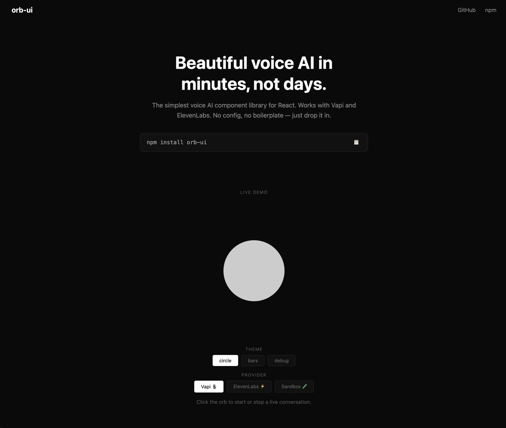

# orb-ui

The simplest way to add voice UI to your React app. One install, one component, works with Vapi and ElevenLabs out of the box.

<p align="center">
  <a href="https://orb-ui.com">
    
  </a>
</p>

<p align="center">
  <a href="https://orb-ui.com">Live Demo</a> · <a href="https://www.npmjs.com/package/orb-ui">npm</a> · <a href="https://github.com/alexanderqchen/orb-ui">GitHub</a>
</p>

```jsx
import { Orb } from 'orb-ui'
import { createVapiAdapter } from 'orb-ui/adapters'

function VoiceOrb({ vapi }) {
  const adapter = createVapiAdapter(vapi, { assistantId: 'your-id' })

  return <Orb adapter={adapter} theme="circle" />
}
```

## Install

```bash
npm install orb-ui
```

> **Note:** Orb uses React hooks internally — in Next.js App Router, use it in a `'use client'` component.

## Quick Start

### With Vapi

```jsx
import Vapi from '@vapi-ai/web'
import { Orb } from 'orb-ui'
import { createVapiAdapter } from 'orb-ui/adapters'

const vapi = new Vapi('your-public-key')
const adapter = createVapiAdapter(vapi, { assistantId: 'your-assistant-id' })

function App() {
  return <Orb adapter={adapter} theme="circle" />
}
```

### With ElevenLabs

```jsx
import { Conversation } from '@elevenlabs/client'
import { Orb } from 'orb-ui'
import { createElevenLabsAdapter } from 'orb-ui/adapters'

const adapter = createElevenLabsAdapter(Conversation, { agentId: 'your-agent-id' })

function App() {
  return <Orb adapter={adapter} theme="circle" />
}
```

### Controlled mode (custom integration)

```jsx
import { Orb } from 'orb-ui'
import { useState } from 'react'

function App() {
  const [state, setState] = useState('idle')
  const [volume, setVolume] = useState(0)

  return <Orb state={state} volume={volume} theme="circle" />
}
```

## Themes

| Theme    | Description                                                                   |
| -------- | ----------------------------------------------------------------------------- |
| `debug`  | State + volume display with start/stop. Use to verify your integration works. |
| `circle` | Pulsing circle that reacts to volume.                                         |
| `bars`   | Five bars that animate with voice.                                            |

## Props

| Prop      | Type                            | Default   | Description                                             |
| --------- | ------------------------------- | --------- | ------------------------------------------------------- |
| `theme`   | `'debug' \| 'circle' \| 'bars'` | `'debug'` | Visual theme                                            |
| `state`   | `OrbState`                      | `'idle'`  | Conversation state (controlled mode)                    |
| `volume`  | `number`                        | `0`       | Audio volume, 0–1 (controlled mode)                     |
| `adapter` | `OrbAdapter`                    | —         | Provider adapter (manages state + volume automatically) |
| `size`    | `number`                        | `200`     | Size in pixels                                          |
| `onStart` | `() => void`                    | —         | Custom start handler (overrides adapter.start())        |
| `onStop`  | `() => void`                    | —         | Custom stop handler (overrides adapter.stop())          |

## States

`idle` · `connecting` · `listening` · `speaking` · `error`

## Supported Providers

| Provider                                              | Adapter                                                  |
| ----------------------------------------------------- | -------------------------------------------------------- |
| [Vapi](https://vapi.ai)                               | `createVapiAdapter` from `orb-ui/adapters`               |
| [ElevenLabs](https://elevenlabs.io/conversational-ai) | `createElevenLabsAdapter` from `orb-ui/adapters`         |
| Custom                                                | Use controlled mode — pass `state` and `volume` directly |

## Development

```bash
git clone https://github.com/alexanderqchen/orb-ui.git
cd orb-ui
pnpm install

# Build the library
pnpm build

# Run demo locally
pnpm dev:demo
```

Useful maintenance commands:

```bash
pnpm check        # format check, lint, typecheck, tests, library build, demo build
pnpm format       # format repo files
pnpm changeset    # add release notes for a user-facing package change
```

Releases are managed with Changesets. Merging a Changesets version PR publishes
`orb-ui` to npm from GitHub Actions using npm trusted publishing.

## License

MIT © [Alexander Chen](https://github.com/alexanderqchen)
